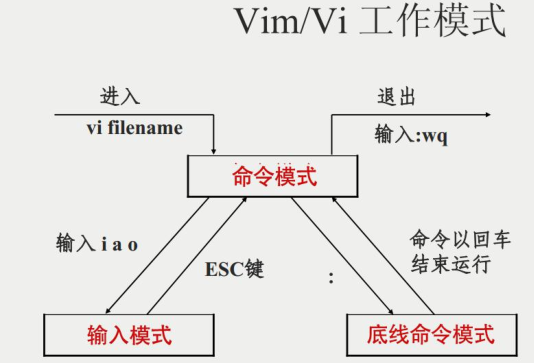
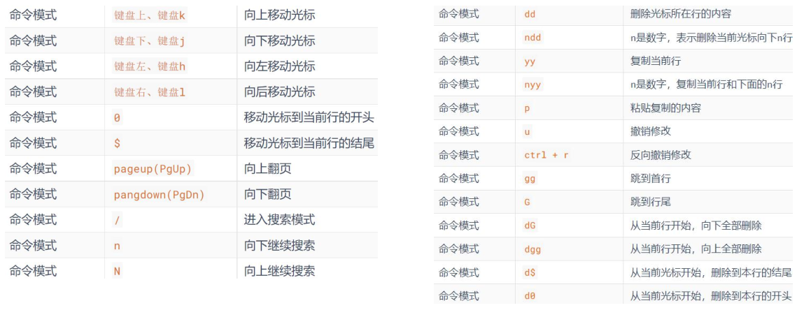
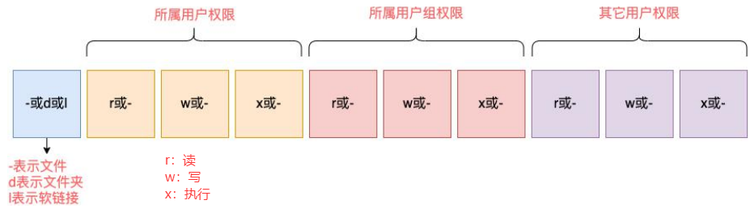
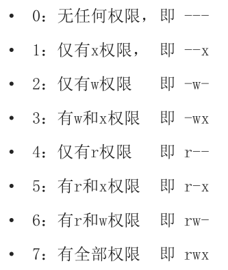
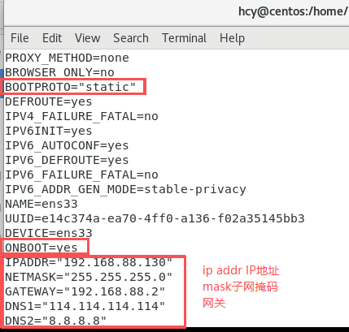
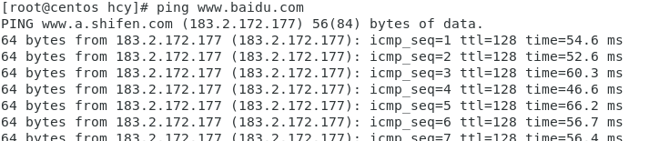

# Linux学习笔记
-------
## 文件操作命令
- ```ls```：平铺列出目录下的文件
- ```ls -l```：竖向列出详细信息
- ```ls -a```：列出所有文件，包括**隐藏文件（.开头的文件）**
- ```ls -al```
- ```ls -lh```：以可读的方式列出文件大小
- ```pwd```：显示当前路径
- ```cd```：切换到当前用户的home目录
-  ```cd ~```：切换到当前用户的home目录
- ```cd 指定路径```：切换指定路径
- ```cd ..```：切换到上级目录
- ```mkdir 指定路径```：在指定路径下创建目录（文件夹）
- ```rmdir 删除指定目录```：删除指定目录（文件夹）
- ```touch 文件名```：创建文件
- ```rm 文件```：删除文件、文件夹
- ```rm -r 目录名```：删除目录及其内容
- ```rm -f 文件```：强制文件
- ```cat 文件名```：查看文件内容
- ```more 文件名```：查看文件内容（分页显示，空格翻页，q退出）
- ```cp 源文件 目标文件```：复制文件、文件夹
- ```mv 源文件 目标文件```：移动文件、文件夹
- ```find 起始路径 -name 文件名```：查找路径下的文件
- ```which 命令```：查找命令的绝对路径
- ```grep 关键词 文件名```：在文件中搜索关键词
- ```wc 文件名```：统计文件行数、单词数、字节数
- ```|``` 管道符  将管道符左边命令的结果，作为右边命令的输入
- ```cat 文件名 | grep 关键词```：在文件中搜索关键词
- ```tail -f 路径/文件名```：实时监控文件内容变化（-f 持续监控）
- ```clear```：清屏
- ```history```：查看历史命令
--------
## 进程管理命令
- ```top```：查看CPU、内存、进程的信息（q或ctrl+c退出）
- ```ps```：查看进程信息
- ```ps -ef```：查看所有进程信息
- ```kill 进程号```：杀死进程
- ```kill -9 进程号```：强制杀死进程
--------
## vi/vim编辑器命令
vim 是 vi 的加强版本，兼容 vi 的所有指令，不仅能编辑文本，而且还具有 shell 程序编辑的功能，可以不同颜色的字体来辨别语法的正确性，极大方便了程序的设计和编辑性
- ```vi/vim 文件名```：打开文件，如果文件不存在，则创建文件

- ```i```：进入编辑模式，在光标位置插入字符
- ```a```：进入编辑模式，在光标后插入字符
- ```I```：进入编辑模式，在当前行首插入字符
- ```A```：进入编辑模式，在当前行尾插入字符
- ```o```：在当前行后插入新行
- ```O```：在当前行前插入新行
- ```Esc```：退出编辑模式，进入命令模式
- Esc被占用时，可以使用```Ctrl + [```或```Ctrl + c```强制退出
- ```:w```：保存
- ```:q```：退出 不保存
- ```:wq```：保存并退出
- ```:q!```：强制退出不保存
- ```wq!```：强制保存并退出
- ```e!```：放弃所有修改，重新打开文件
  
--------
## 权限管理命令
- ```ls -l```:以列表形式查看内容，并显示权限细节
- 权限细节10个槽位!
  
u表示user所属用户权限，g表示group组权限，o表示other其它用户权限
- ```chmod u=rwx,g=rwx,o=rwx 文件名```:将文件权限修改为rwxrwxrwx
- ```chmod 777 文件名```:将文件权限修改为rwxrwxrwx
  
- ```chown 用户名:组名 文件名```:修改文件所有者和组
--------
## 用户管理命令
- ```su -```：切换到root用户,```-```表示切换到root用户的shell环境,最好带上
- ```exit```：退回到上一个用户
- 快捷键```Ctrl + d```：退回到上一个用户 
- ```sudo 其他命令```：让普通命令带有root权限执行
- ```groupspadd 组名```：创建组
- ```groupdel 组名```：删除组
- ```useradd -m -g 组名 用户名```：创建用户，并指定组 
- ```usermod -g 组名 用户名```：修改用户组 
- ```userdel 用户名```：删除用户，保留home目录 
-  ```userdel -r 用户名```：删除用户及其home目录 
- ```passwd 用户名```：修改用户密码 
- ```getent passwd 用户名```：查看用户信息 
- ```getent group 组名```：查看组信息 
- ```id 用户名```：查看用户ID 
--------
## 快捷键小技巧
-  ```Ctrl+c```：强制退出
-  ```Ctrl+d```: 退出，登出（但是不能退出vi/vim编辑器）
-  ```Ctrl+a```：光标移动到行首
-  ```Ctrl+e```：光标移动到行尾
-  ```Ctrl+左键```：光标向前移动一个字符
-  ```Ctrl+右键```：光标向后移动一个字符
-  ```Ctrl+l```：清屏 
--------
## 软件安装
**CentOS使用yum管理器，Ubuntu使用apt管理器，需要root权限和联网**
- ```yum install 软件名```：安装软件
- ```yum remove 软件名```：卸载软件
- ```yum update 软件名```：更新软件
- ```yum search 软件名```：搜索软件
- ```apt install 软件名```：安装软件
- ```apt remove 软件名```：卸载软件
- ```apt update 软件名```：更新软件
- ```apt search 软件名```：搜索软件
--------
## 网络配置（IP 网关 DNS）
- ```ifconfig```：查看IP地址
**标准 IP 地址：**
-  IPv4版本的地址格式是：a.b.c.d，其中abcd表示0~255的数字
-  inet addr(NAT模式分配的IP地址)、bcast(广播地址)、mask(子网掩码)
-  编辑→虚拟网络编辑器→NAT设置→网关
-  不同版本Linux的网络配置文件在不同的地方
   
-  ```service network restart```：重启网络服务
-  ```ping www.baidu.com```：测试网络连通性
   
- IPv6很少用
**特殊 IP 地址：**
- 127.0.0.1：本机
- 0.0.0.0：
  1、可以用于指代本机；
  2、可以在端口绑定中用来确定绑定关系；
  3、在一些IP地址限制中，表示所有IP的意思，如放行规则设置为0.0.0.0，表示允许任意IP访问。
- 255.255.255.255：表示广播地址，用于向局域网内的所有计算机发送信息
**配置固定IP地址：**
1、在虚机中设置IP地址网关和网段
2、在Linux系统中手动修改配置文件，固定IP地址 
--------
## 网络传输命令
- ```ping 主机名或IP地址```：测试网络连通性
- ```telnet 主机名或IP地址 端口号```：远程登录主机
- ```wget 文件URL```：下载文件
- ```curl 文件URL```：下载文件、获取网页内容
--------
## 服务管理
- ```systemctl start 服务名```：启动服务
- ```systemctl stop 服务名```：停止服务
- ```systemctl restart 服务名```：重启服务
- ```systemctl enable 服务名```：设置开机启动
- ```systemctl disable 服务名```：设置开机不启动
- ```systemctl status 服务名```：查看服务状态
--------


